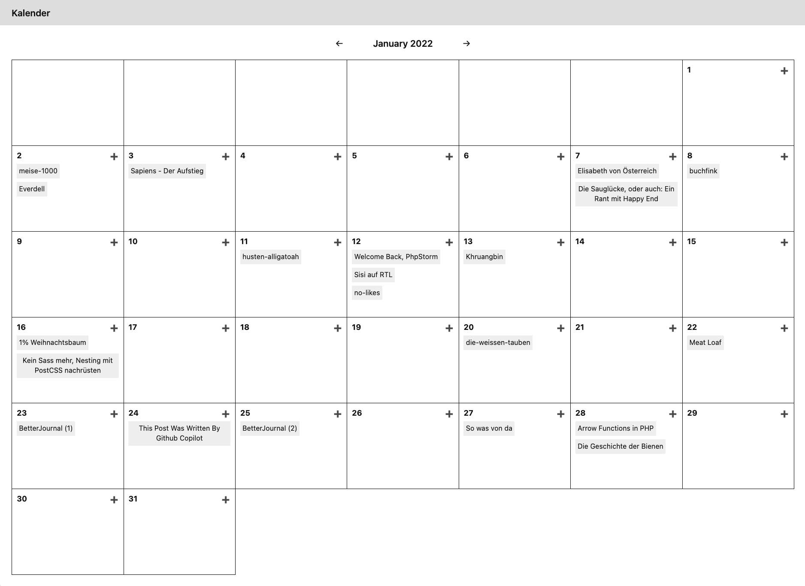

# Kirby Calendar View Plugin

This plugin provides a new panel section that provides a calendar view. It shows all children and grandchildren of a given parent in a calendar view. The Pages need to have a field called `date`. Maybe I should make this configurable.




## Installation

1. `composer require pwaldhauer/kirby-calendar-view` or copy the files to the `site/plugins` folder.
2. Add the section to a blueprint:

```
sections:
  calendar:
    type: calendar-view
    headline: Kalender
    target: blog
    parent: blog
    defaultTemplate: blog-post
```

## Blueprint options

- `headline`: Printed above the section
- `target`: The path to the page a new one will be a child of. `[YEAR]` will be replaced with the current year (e.g. 2020).
- `parent`: This is the parent page of all shown posts
- `defaultTemplate`: Default template 


## License

MIT
